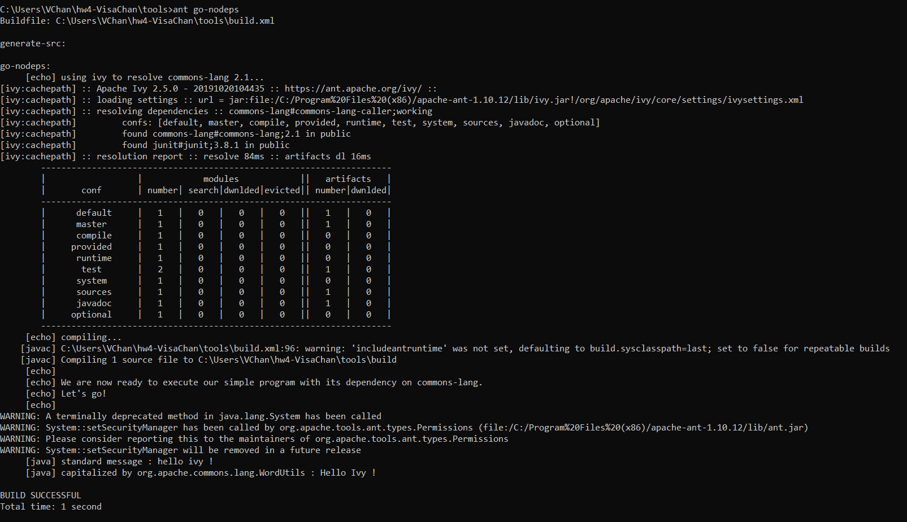

# Instructions
Vincent Chan 1534556

**TODO:** Add your screen captures to a new directory called [images](images).

**HINT:** Embed your screen captures as requested in the sections below. You can embed the image using the following syntax:

```

```

The first argument is the Alt-text for the image. The second argument is the path to the image. Make sure your images are readable and that you save them in a JPG or PNG format.

# Ant+Ivy [40 pts]
- [5 pts] A screen capture showing the version of Ant that you installed and its install directory. <br />
Ant Version <br />
 <br />
Ant Directory from File Explorer and Command Prompt <br />
 <br />
 <br />
- [5 pts] A screen capture showing the output generated by the `ant go-nodeps` execution during the Ivy installation. <br />
	   <br />
- [15 pts] A screen capture showing a successful build using the Ant+Ivy script. <br />
	   <br />
- [5 pts] A screen capture showing a successful execution of the JAR file created from the Ant+Ivy build. <br />
	   <br />
- [10 pts] Links to the complete and correct [hello-world/build.xml](hello-world/build.xml) and [hello-world/ivy.xml](hello-world/ivy.xml) files. <br />
	  build.xml: https://github.com/depaulcdm/hw4-VisaChan/blob/master/hello-world/build.xml <br />
	  ivl.xml: https://github.com/depaulcdm/hw4-VisaChan/blob/master/hello-world/ivy.xml <br />
	
# Maven [30 pts]
- [5 pts] A screen capture showing the version of Maven that you installed and its install directory. <br />
Maven Version <br />  
 <br />
Maven Directory from File Explorer and Command Prompt <br />
 <br />
 <br />
- [10 pts] A screen capture showing a successful build using the Maven script. <br />
	   <br />
- [5 pts] A screen capture showing a successful execution of the JAR file created from the Maven build. <br />
	   <br />
- [10 pts] Links to the complete and correct [hello-world/pom.xml](hello-world/pom.xml) file. <br />
	  pom.xml: https://github.com/depaulcdm/hw4-VisaChan/blob/master/hello-world/pom.xml <br />

# Gradle [30 pts]
- [5 pts] A screen capture showing the version of Gradle that you installed and its install directory. <br />
Gradle Version <br />
 <br />
Gradle Directory from File Explorer and Command Prompt <br />
 <br />
 <br />
- [10 pts] A screen capture showing a successful build using the Gradle script. <br />
	   <br />
- [5 pts] A screen capture showing a successful execution of the JAR file created from the Gradle build. <br />
	   <br />
- [10 pts] Links to the complete and correct [hello-world/build.gradle](hello-world/build.gradle) file. <br />
	  build.gradle: https://github.com/depaulcdm/hw4-VisaChan/blob/master/hello-world/build.gradle <br />
